# Introduction to DevOps Tools

## TOC

1. [All About DevOps](#all-about-devops)
2. [Git and GitHub](#git-and-github)
3. [All About Jenkins](#all-about-jenkins)
4.

## All About DevOps

DevOps culture is implemented in several phases with the help of several tools

Dev

1. Plan
1. Code
   1. [](https://git-scm.com)
1. Build
   1. [](https://maven.apache.org)
   1. [](https://gradle.org)
1. Test
   1. [](https://www.selenium.dev)

Integrate

1. [](https://www.jenkins.io)

Ops

1. Deploy
1. Operate
   1. [](https://www.ansible.com)
   1. [](https://www.docker.com)
   1. [](https://kubernetes.io)
   1. Monitor
      1. [Nagios](https://www.nagios.org)


[ref](https://d1jnx9ba8s6j9r.cloudfront.net/blog/wp-content/uploads/2019/06/DevOps-Tools-DevOps-Tutorial-Edureka-1.png)

### Waterfall Model

- Waterfall model is a traditional approach of software development
- In waterfall model, development happens in a step-by-step manner


[ref](https://www.tech-faq.com/waterfall-model.html)

1. **Requirement analysis**
   - programmers accept the client requirements and analyze them
1. **Design**
   - programmers then come up with a project plan and a design architecture
1. **Development/Implementation**
   - programmers code the application as per project plan and design
1. **Testing/Verification**
   - testing ensures the application is error-free and meets the requirements
1. **Maintenance**
   - after application is delivered, the operations team maintain the application

Disadvantages:

- Any new requirements from the client will restart the development cycle
- If client is unhappy with the product, the entire project cycle is restarted
- Until the requirements are not clear, the project cannot start and is eventually delayed

Using the waterfall model, companies soon came to realize:

1. client requirements cannot be understood at once
1. it is very expensive to make changes during the end of the project
1. software must be delivered faster and with less resources

### Agile Model

Following the Agile model, programmers create prototypes to understand client requirements

1. client sends his requirements to the programmer
1. programmer creates a prototype of the application
1. client provides feedback and list of changes to be made

The entire process of building a software is broken down into small actionable blocks called sprints (usually approximately 2 weeks long)

Agile Ceremony


- Plan
- Code
- Test
- Review

Advantages:

- client requirements are better understood because of the constant feedback
- product is delivered much faster as compared to waterfall model

Disadvantages:

- product gets tested only on developer computers and not on production systems
- developers and operations team work in separate silos
  - when the product fails in production servers, the operations team are clueless and send product back to the development team

Agile Model

```mermaid
   flowchart LR
      d[developer] --product-->o[operations]--product-- --X-->ps[Product server]
```

### What is DevOps?

- DevOps is an evolution from Agile model of software development

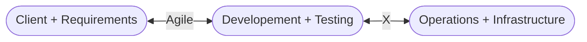

- Agile addressed the gap between the development team and the operations team

1. development team will submit the application to the operations team for Implementation
2. operations team will monitor the application and provide relevant feedback to developers

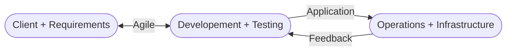

### DevOps Phases

According to DevOps practices, the workflow in software development and delivery is divided into 8 phases


[ref](https://spectralops.io/blog/the-essential-guide-to-understanding-the-devops-lifecycle/)

1. Plan
   1. business owners and software development team discuss project goals and create a plan
1. Code
   1. programmers then design and code the application and use tools like Git to store application code
1. Build
   1. build tools like Maven and Gradle, take code from different repositories and combine them to build the complete application
1. Testing
   1. application is tested using automation testing tools like Selenium and JUnit to ensure software quality
1. Integrate/Release
   1. when testing is complete, new features are integrated automatically to the already existing codebase
1. Deploy
   1. application is packaged after release and deployed from development server to production server
1. Operate
   1. once software is deployed, operations team perform activities such as configuring servers and provisioning them with the required resources
1. Monitor
   1. monitoring allows IT organization to identify specific issues of specific releases and understand the impact on end-users

### DevOps Tools


[ref](https://dzone.com/articles/how-to-orchestrate-devops-tools-together-to-solve)

### DevOps Process

Continuous Delivery


### DevOps Advantages

Companies which follow DevOps, release more products and features within a short amount of time

- Time taken to create and deliver software is reduced
- Complexity of maintaining an application is reduced
- Improved collaboration between developers and operations team
- Continuous integration and delivery ensure faster time to market

[back](#toc)

## Git and GitHub

### Version Control System (VCS)

Allows all files to be stored in a single repository (repo) and also allows for easy collaboration on those files.

- all files in System A are stored as Version 1 in the remote repository
- some one wants to make changes to those files in the repo, they check them out, make the changes and then push them back onto the remote repo, thus updating the version history to Version 2

VCS allows you to store multiple versions of a system file in the remote repo

### Distributed Version Control System

Ability for the code to be shared across a team of developers

- All the developers have the entire copy of code on their local system
- Distributed VCS moves from client-server approach of Central VCS to peer-to-peer approach

Git tool is an example of Distributed VCS


[ref](https://homes.cs.washington.edu/~mernst/advice/version-control.html)

### What is Git?

Git is a distributed version control tool used for source code management

- used to track the changes in the source code
- allows multiple developers to work together
- supports non-linear development because of thousands of parallel branches
- has the ability to handle large projects efficiently

GitHub is the server


[ref](https://www.c-sharpcorner.com/article/git-and-github-version-control-local-and-remote-repository/)

### Git vs GitHub

|                        git                         |                   github                   |
| :------------------------------------------------: | :----------------------------------------: |
|                   software tool                    |                  service                   |
|                 installed locally                  |             hosted on the web              |
|   manages different versions of the source code    | houses a copy of the local repository code |
| provides a command line to interact with the files |     provides a gui to store the files      |


[ref](https://i.stack.imgur.com/jwCeV.png)

### Git Architecture

- Local
  - Working Directory
    - folder where you are currently working
  - `git add` to staging area
    - you add your files to the staging area before making a commit
  - `git commit` to local repository
    - after making all the changes, you commit those files to the local repository
- Remote
  - `git push` to remote repository
    - you can push the committed files to the remote repository
  - `git pull` from remote repository
    - fetches all the changes from a remote repository to a local repository
- Local
  - `git checkout` from local repository
    - you can create new branches and switch to them as and when required
  - `git merge`
    - after you are done with the changes, you can merge the new branches to the master branch


### Git Concepts

1. [Fork and Clone](#fork-and-clone)
1. [Adding Collaborators](#collaborators)
1. [Branch in Git](#git-branch)
1. [Pull from a remote](#pull-from-a-remote)
1. [Git Rebase](#git-rebase)

#### Fork and Clone

Git allows you to fork an open source repository. When you fork a repository, you create a copy of it on your GitHub account.

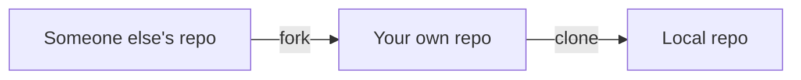

#### Collaborators

GitHub allows you to work with users from all over the world at any given time.

- Collaborators are GitHub users who are given permission to edit a repository owned by someone else
  - Access all the files
  - View the files
  - Make changes to the files
  - Commit the files

#### Git Branch

You can create a new branch and build a new feature on that branch

- by default, you always work on the main branch

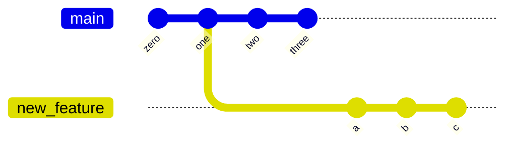

Branch in Git is used to keep your changes until they are ready

**Git Merge**

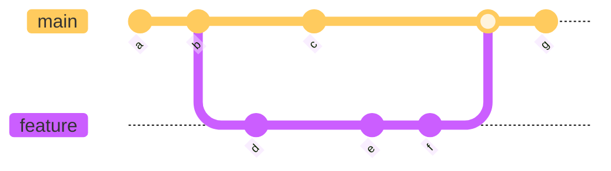

#### Pull from a remote

You can pull in any changes that have been made from your forked remote repository to the local repository

```bash
$ git pull <remoteName> <branchName>
```

- if there is no change, it will notify "Already up-to-date". If there is a change, it will merge those changes to your local repository

#### Git Rebase

Git rebase is the process of of combining a sequence of commits to a new base commit

- the primary reason for rebasing is to maintain a linear project history
- when you rebase, you "unplug" a branch and "replug" it on the tip of another branch (usually main)
- the goal of rebasing is to take all the commits from a feature branch and put it on the main branch

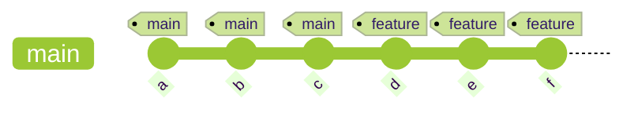

Resulting history is linear with no divergent branches

- reduces the total storage space needed

### Popular Git Commands

- :red_circle: `git init`: initialize a local git repository
- :red_circle: `git add`/`git add .`: add one or more files to a staging area
- :red_circle: `git commit -m "some commit message"`: commit changes to head but not to the remote repository
- :red_circle: `git status`: check the status of your current repository and list the files you have changed
- :red_circle: `git log`: provides a list of all commits made on your branch
- :red_circle: `git diff`: view the changes you have made to the file
- :red_circle: `git push origin <branch name>`: push the branch to the remote repository so other can use it
- :red_circle: `git config --global user.name "User Name"`: tell git who you are by configuring the author name
- :red_circle: `git config --global user.email "email@example.com"`: tell git who you are by configuring the author email id
- :red_circle: `git clone`: create a git repository copy from a remote source
- :red_circle: `git remote add origin <server>`: connect your local repository to the remote server and add the server to be able to push to it
- :red_circle: `git branch <branch name>`: create a new branch
- :red_circle: `git checkout <branch name>`: switch from one branch to another branch
- :red_circle: `git merge <branch name>`: merge a branch into the active branch
- :red_circle: `git rebase`: reapply commits on top of another base tip

[back](#toc)

## All About Jenkins

### Before Jenkins

- Developers had to wait till the entire software code was built and tested to check for errors
- Developers had to check the entire source code to find the errors, in such case, fixing bugs was very difficult
- There was no iterative improvement of code and software delivery process was slow

### What is Jenkins

- a Continuous Integration tool that allows continuous development, test and deployment of newly created code

_Nightly build and integration_

- team needs to commit and push all code by some arbitrary time (usually end of the work day)

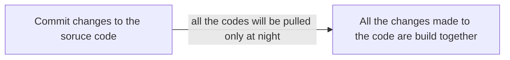

_Continuos Integration_

- team no longer has an arbitrary time to push code, now they can commit and push whenever it is feasible to do so
- test and verification services are now built into the environment, so whenever the developer pushes the code to the repo, it can be tested and verified during the push

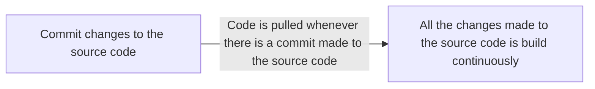

### What is Continuous Integration

- developer writes and submits code to a repository
- repository sends the code to a Continuous Integration (CI) server
- CI server runs tests against the code and if fails, then sends it back to the developer to fix
  - This allows the developer to do two things:
    - to not break the build
    - to not run all the tests locally on their machine
  - If pass, goes on to the tester to run more tests than the standard tests the CI server runs
    - if the tester catches errors, then they can send directly back to developer
- **GOAL:** Release and deploy

### Continuous Integration Tools

- **Bamboo**
  - can run multiple builds in parallel for faster compilation
  - it has built in functionality to connect with repositories and has build tasks for Ant, Maven, etc.
- **Buildbot**
  - an open-source framework for automating software build, test, and release processes
  - it is written in Python and supports distributed, parallel execution of jobs across multiple platforms
- **Apache Gump**
  - designed with the aim to build and test all the open source Java projects, every night
  - it makes sure that all the projects are compatible at both API level and functionality level
- **Travis CI**
  - is a hosted, distributed continuous integration service used to build and test software projects hosted at GitHub
  - it's build for projects and team of all sizes and supports over 20 different languages
- **Jenkins**
  - is an open-source automation server written in Java
  - used to automate software development process via continuous integration facilitates continuous delivery

### Features of Jenkins

1. Easy installation
   - self contained Java-based program, ready to run woth packages for Windows, Mac OS X, and Unix-like OS
1. Easy configuration
   - it can easily set up and configured via it's web interface which includes error checks and built-in help
1. Plugins
   - it has hundreds of plugins in the Update Center and integrates with every tool in the CI and CD toolchain
1. Extensible
   - can be extended via its plugin architecture and provides nearly infinite possibilities for what it can do
1. Distributed
   - it can easily distribute work across multiple machines, helping in faster builds, tests, and deployments across multiple platforms

### Jenkins Pipeline

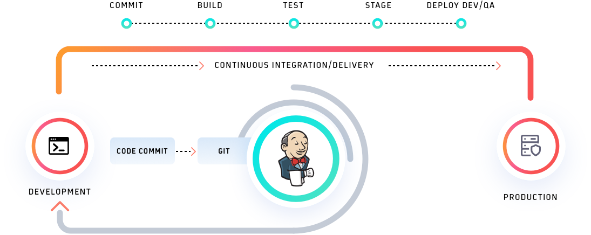
[source](https://www.lambdatest.com/blog/jenkins-pipeline-tutorial/)

### Jenkins Architecture

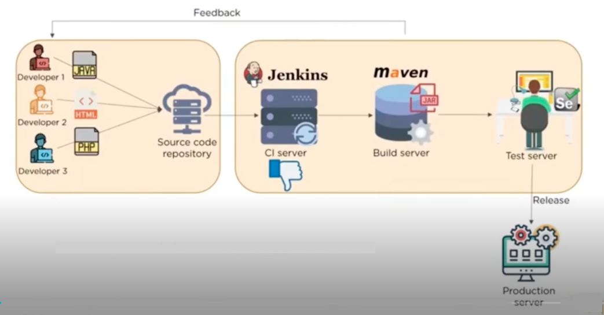

- Broken up into two sections
  - Section 1
    - Developers commit changes to the source code
  - Section 2
    - Jenkins server checks the repostitory at regular intervals adn pulls any newly available code
    - Build Server (such as Maven) builds the code into an executable file
      - In case the build fails, a feedback is sent to the developers
    - Test Server (such as Selenium) for testing
      - if the test fails, feedback is immediately passed on to the developers

> If you have different code files
>
> - The files could be very large and may require multiple builds
> - Singe Jenkins server cannot handle multiple files and builds
>
> Need to distribute Jenkins architecture to overcome such issues

### Jenkins Master-Slave Architecture

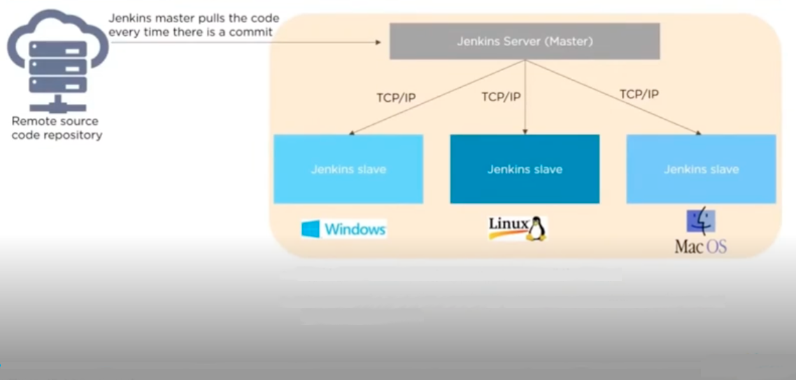

- Jenkins master distributes its workload to all the slaves
- On request from Jenkins master, the slaves carry out builds and tests and produce test reports

### Jenkins Installation

- Web-Application written in Java can be run/installed in 3 ways:

1. Windows or Linux/Unix services
2. Generic war file
3. Instll on any Java based web servers - Apache Tomcat

### Jenkins Prerequisites

- There are some prerequisites to install Jenkins
  - Java Development Kit (JDK 1.7 or 1.8)
  - 2GB RAM
  - Set environment variable JAVA_HOME to point to JDK base directory
    - ex: `C:\Program Files\Java\jdk1.8.0_162`

### Jenkins root folder

Jenkins stores all its configuration data, jobs and project workspace in a Root/Parent folder

- `C:\Program Files (x86)\Jenkins or`
- `C:\User_Home_Dir\.Jenkins`

[back](#toc)
