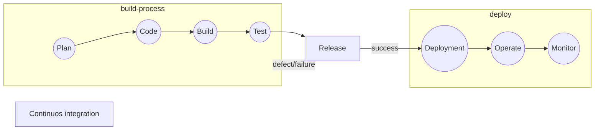

# Introduction to DevOps Tools

## TOC

1. [All About DevOps](#all-about-devops)

### All About DevOps

DevOps culture is implemented in several phases with the help of several tools

Dev

1. Plan
1. Code
   1. 
1. Build
   1. 
   1. 
1. Test
   1. 

Integrate

1. 

Ops

1. Deploy
1. Operate
   1. 
   1. 
   1. 
   1. Monitor
      1. [Nagios](https://www.nagios.org)

[ref](https://d1jnx9ba8s6j9r.cloudfront.net/blog/wp-content/uploads/2019/06/DevOps-Tools-DevOps-Tutorial-Edureka-1.png)

#### Waterfall Model

- Waterfall model is a traditional approach of software development
- In waterfall model, development happens in a step-by-step manner

[ref](https://www.tech-faq.com/waterfall-model.html)

1. **Requirement analysis**
   - programmers accept the client requirements and analyze them
1. **Design**
   - programmers then come up with a project plan and a design architecture
1. **Development/Implementation**
   - programmers code the application as per project plan and design
1. **Testing/Verification**
   - testing ensures the application is error-free and meets the requirements
1. **Maintenance**
   - after application is delivered, the operations team maintain the application

Disadvantages:

- Any new requirements from the client will restart the development cycle
- If client is unhappy with the product, the entire project cycle is restarted
- Until the requirements are not clear, the project cannot start and is eventually delayed

Using the waterfall model, companies soon came to realize:

1. client requirements cannot be understood at once
1. it is very expensive to make changes during the end of the project
1. software must be delivered faster and with less resources

#### Agile Model

Following the Agile model, programmers create prototypes to understand client requirements

1. client sends his requirements to the programmer
1. programmer creates a prototype of the application
1. client provides feedback and list of changes to be made

The entire process of building a software is broken down into small actionable blocks called sprints (usually approximately 2 weeks long)

- Plan
- Code
- Test
- Review

Advantages:

- client requirements are better understood because of the constant feedback
- product is delivered much faster as compared to waterfall model

Disadvantages:

- product gets tested only on developer computers and not on production systems
- developers and operations team work in silos
  - when the product fails in production servers, the operations team are clueless and send product back to the development team

#### What is DevOps?

- DevOps is an evolution from Agile model of software development
- Addresses the gap between the development team and the operations team

1. development team will submit the application to the operations team for Implementation
1. operations team will monitor the application and provide relevant feedback to developers

#### DevOps Phases

According to DevOps practices, the workflow in software development and delivery is divided into 8 phases

[ref](https://spectralops.io/blog/the-essential-guide-to-understanding-the-devops-lifecycle/)

1. Plan
   1. business owners and software development team discuss project goals and create a plan
1. Code
   1. programmers then design and code the application and use tools like Git to store application code
1. Build
   1. build tools like Maven and Gradle, take code from different repositories and combine them to build the complete application
1. Testing
   1. application is tested using automation testing tools like Selenium and JUnit to ensure software quality
1. Integrate/Release
   1. when testing is complete, new features are integrated automatically to the already existing codebase
1. Deploy
   1. application is packaged after release and deployed from development server to production server
1. Operate
   1. once software is deployed, operations team perform activities such as configuring servers and provisioning them with the required resources
1. Monitor
   1. monitoring allows IT organization to identify specific issues of specific releases and understand the impact on end-users

#### DevOps Tools

[ref](https://dzone.com/articles/how-to-orchestrate-devops-tools-together-to-solve)

#### DevOps Process

Continuous Delivery

#### DevOps Advantages

Companies which follow DevOps, release more products and features within a short amount of time

- Time taken to create and deliver software is reduced
- Complexity of maintaining an application is reduced
- Improved collaboration between developers and operations team
- Continuous integration and delivery ensure faster time to market
